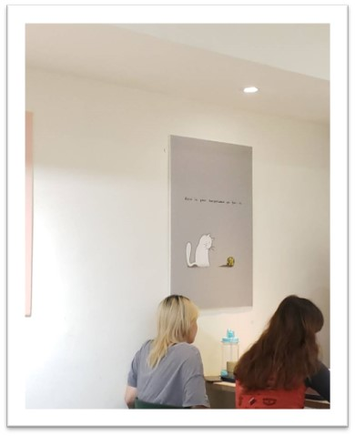
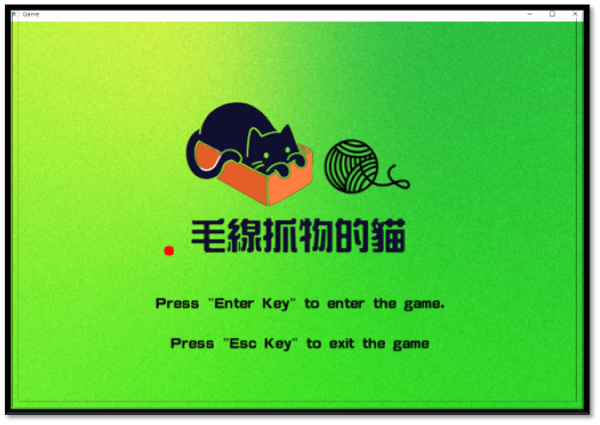
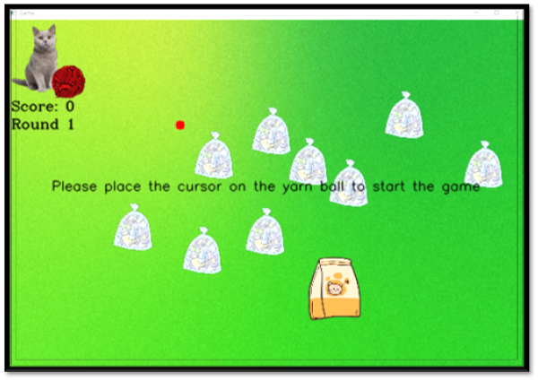
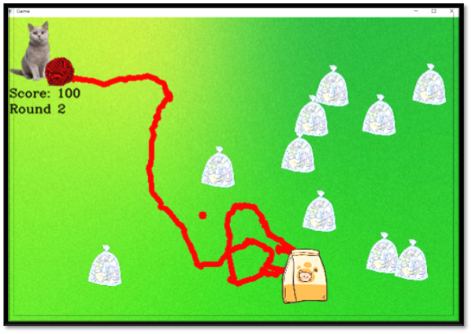
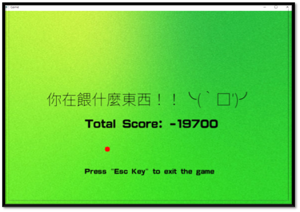
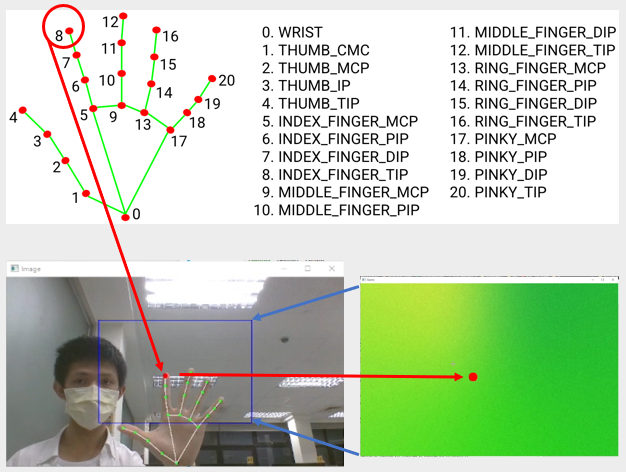

# 毛線抓物的貓（YarnGrabCat）

執行前請在 Anaconda 開啟 terminal 執行以下指令並安裝所需 Package：
```
pip install opencv-python
pip install mediapipe
pip install import-ipynb
```

## 開發動機
在某天悠閒的午餐時光，思考著多媒體課程的期末報告應該以什麼方式來展現，突然被店裡牆上可愛的貓咪吸引。貓咪與毛球的互動配上早午餐的隨機搭配，正好符合我們想用OpenCV來實現的擁有互動性與隨機性的遊戲發想，靈感就是來的這麼突然。我們想藉由本專案來體驗製作影像辨識與偵測的遊戲內容。  


## 遊戲介紹
1. 透過影像辨識以手部食指指尖為引導點
2. 控制游標觸碰到貓身上即開始遊戲
3. 游標移動會留下行徑路線（毛線），遊戲頁面中有垃圾、飼料，依照規則累積分數    
4. 遊戲結束前總共五回合餵食，以最後累積分數為當次遊戲總得分，加油餵食你的貓貓吧！  

## 計分方式 
觸碰物品即餵貓貓食用道具，飼料獲得分數+100，垃圾獲得分數-100，餵食一次即結束當回合，並顯示當前分數於貓下方

## 遊戲展示
 
 
 
 

## 設計原理
### 1. 手部偵測（hand_Track_Module.ipynb）
- 遊戲游標位置 = 攝像頭偵測的食指位置
- 啟用 MediaPipe 函式庫的手掌偵測函式
- 將串流影像放到手掌偵測函式
- 對照右圖的手掌節點，尋找企圖追蹤的節點號碼 (如該遊戲以食指作為游標，則追蹤8號節點)
- 紀錄該節點位置，並映射該位置至遊戲畫面座標
- 定義遊戲範圍於攝像頭畫面，以利對照與操作  
 
### 2. 路線繪製與回推（Game.ipynb）
#### 路線繪製原理
- 定義空陣列，紀錄畫線經過的所有節點，以利後續回推。畫線時透過持續呼叫函式cv2.line()將目前的游標位置與前一次的游標位置相連
#### 路線回推原理
- 使用紀錄節點的陣列進行回推
- 從陣列的初始點一路畫到最終點，並將最終點清空
- 快速重複上步驟多次，直到陣列為空(表示回到起點)
#### 結論：表面上路線倒轉，實際上不斷重複繪製經過的路線，只是繪製的路線會越來越短直到消失不見

## 未來展望
經過這次的關於影像辨識的期末報告，讓我們發現其無限的可能，我們可以將類似的概念繼續利用及延伸也許可以發想出更多有趣的玩法，像是現在有實際利用於遊戲上的偵測投影，讓遊戲與玩家間更有互動感。類似的例子有好萊塢環球影城以超級任天堂世界為主題的其中一個室內互動遊戲<暗影對決之戰>，是可跟屏幕互動的遊戲區，可以同時很多玩家一起進行，且可以使用電子手環來累積分數。還有 DeNA 旗下網頁遊戲舉辦的《鬼太郎妖怪市集》實體逃脫遊戲「鬼太郎妖怪市集逃走 華山橫行」，實境逃脫活動是利用投影和動作偵測技術打造出來的互動式活動。妖怪市集場景透過全境投影完整呈現在活動現場的牆面上，所有場景和角色的影像皆以即時運算的方式和玩家的動作進行互動。這些都是未來我們可以學習及效仿的例子。
